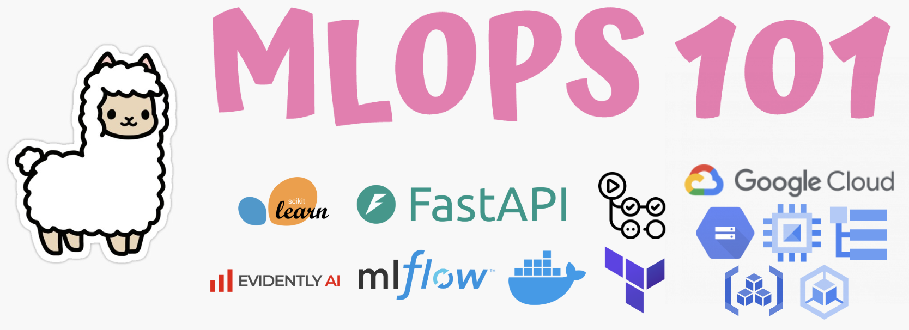

## MLOps 101

I learned a tonne from great teachers about taking models from notebook to production (full list below), and I wanted to make something that not just combines all of them, but will also allow me to run a mini-course on MLOps in my university club (Mar-Jun '25). This is still a work in progress and I welcome any feedback/pull requests/issues.

The choice of tools is a combination of what I learned are industry standard, what I'm comfortable with, and frankly ~ tools I find cool.

## ML System for a Taxi Fare Prediction Model


- Monthly/Batch data is ingested from the NYC taxi API into Google Cloud Storage (GCS). At the start of each month a Github Action looks for new data and uploads it
- Data is preprocessed and loaded into its own location on GCS, ready for model training
- EvidentlyAI data reports are created on a monthly basis using a Github Action. EvidentlyAI is set up using it's free cloud version for easy remote access.
- A linear regression model is trained on the preprocessed data. Both data and models are traced by tagging them either using the execution date or git sha. Everything is logged and registered in MLFlow. MLFlow is hosted on a Google Cloud Engine (VM) for remote access, and the server is started automatically on VM start. Pushes to the `train_model` branch trigger a Github Action to take information from the project config, train a model and register it in MLFlow. The latest model has a @latest tag on mlflow which is used downstream
- A containerised FastAPI endpoint reads in the model with the @latest tag and uses it for on a `/predict` HTTP endpoint
- A GitHub action takes the FastAPI container, deploys it to Google's Artifact Registry, deploys it to Google Kubernetes Engine, and exposes a public service endpoint
- Cloud logging is set up to read logs and filter logs only related to the model endpoint, and saves them to GCS
- All Google Cloud Platform services are created using Terraform

### MLFlow

- Experiments in MLFlow


- Models and their tags


### Github Actions

- I took the pictures before `destroy`ing all cloud services. I will miss all the green checks


### Google Kubernetes Engine

- I ran it with only 1 replica but can easily be adjusted. Check `src/make_api/resources.yaml` for K8s resources


### Model Endpoint

- Check `src/make_api` for setup


### EvidentlyAI Report


### Structure

```shell
mlops-101
├── .env.sample
├── .github # Contains the Github Action workflows
│   └── workflows/
│       ├── build_and_deploy_api.yaml
│       ├── generate_evidently_report.yaml
│       ├── load_data.yaml
│       └── train_model.yaml
├── .gitignore
├── .pre-commit-config.yaml
├── .python-version
├── README.md
├── project-config.yaml # Contains variables/params used in different pipelines
├── pyproject.toml
├── scripts/ # Contains the executable flows
│   ├── 0_load_batch_data.py
│   ├── 1_load_monthly_data.py
│   ├── 2_process_data.py
│   └── 3_train_model.py
├── src/
│   ├── make_api/ # Contains the FastAPI model endpoint deployment files
│   │   ├── Dockerfile
│   │   ├── app/
│   │   │   └── main.py
│   │   ├── requirements.txt
│   │   └── resources.yaml
│   ├── make_data/ # Contains code related to dealing with data
│   │   ├── data_loader.py
│   │   ├── data_processor.py
│   │   └── gcs_connector.py
│   ├── make_infra/ # Contains Terraform setup
│   │   ├── main.tf
│   │   └── variables.tf
│   ├── make_model/ # Contains ModelTrainer class
│   │   └── model_trainer.py
│   ├── make_monitoring/ # Contains code to produce EvidentlyAI reports
│   │   └── create_report.py
│   ├── project_config.py
│   └── utils.py
├── tests/
│   ├── conftest.py
│   ├── test_api.py
│   ├── test_data_loader.py
│   ├── test_data_processor.py
│   ├── test_gcs_connector.py
│   ├── test_model_trainer.py
│   ├── test_project_config.py
│   └── test_utils.py
└── uv.lock
```

### Basic Setup

Local Setup (on Mac):

- `uv venv -p 3.11`
- `source venv/bin/activate`
- `uv pip install -r pyproject.toml --all-extras`
- `uv lock`

Cloud Resources Setup:

- get a service account json from GCP and paste the path to it in the `.env`
- go to `src/make_infra` and run `terraform init`, `terraform plan`, `terraform apply` (`terraform destroy` to shut down everything)

Local Development:

- when running scripts through your terminal, run `export UV_ENV_FILE=".env"` to run uv with an env file by default
- `uv run {path_to_python}`
- `pre-commit install` - to run pre-commit hooks automatically
- `uv run pre-commit run --all-files` and `uv run pytest` to run pre-commit hooks and tests

### List of resources:

- [Marvelous MLOps' substack](https://marvelousmlops.substack.com/)
- [DataTalksClub's MLOps zoomcamp](https://github.com/DataTalksClub/mlops-zoomcamp)
- [Chip Huyen's book](https://www.amazon.com/Designing-Machine-Learning-Systems-Production-Ready/dp/1098107969)
- [Andy McMahon's book](https://www.oreilly.com/library/view/machine-learning-engineering/9781837631964/)
- [MLOps blog](https://ml-ops.org/)
- [Kubernetes video](https://www.youtube.com/watch?v=d6WC5n9G_sM&pp=ygUZa3ViZXJuZXRlcyBpbnRybyBic3RzY2h1aw%3D%3D)
